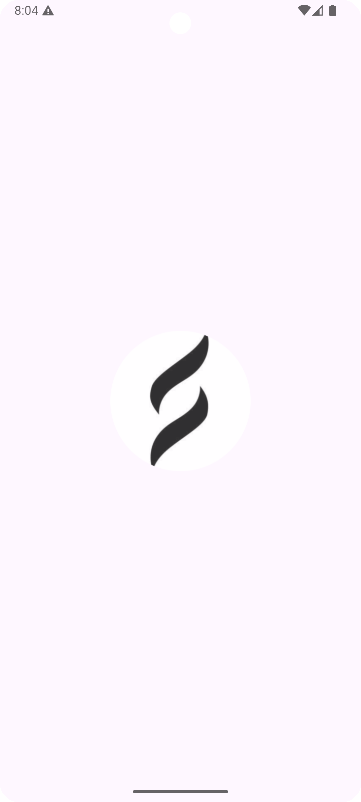
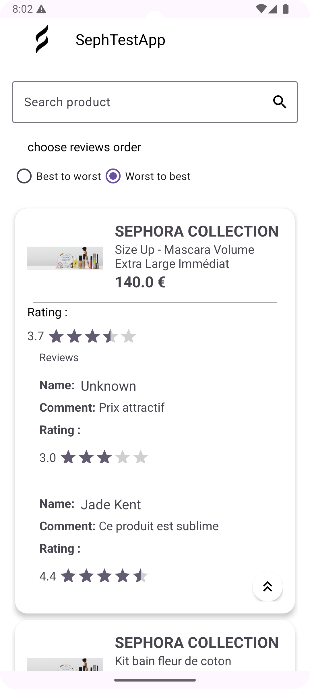
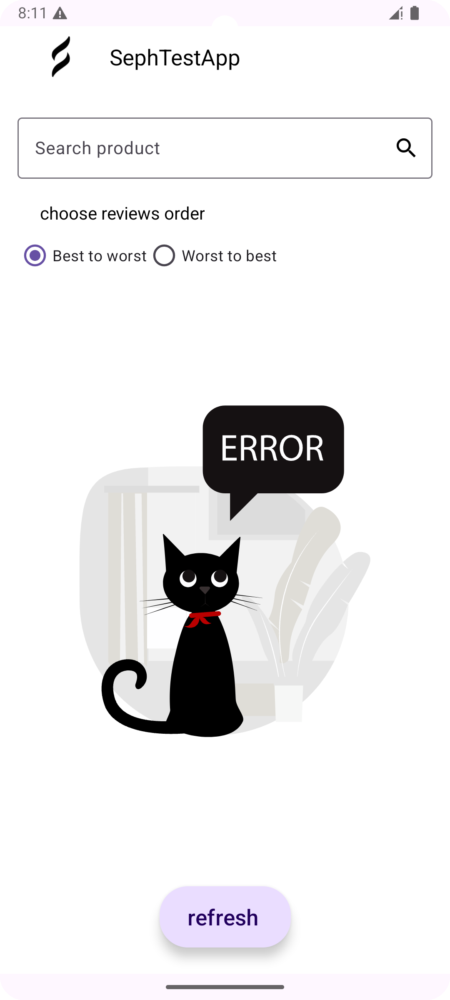
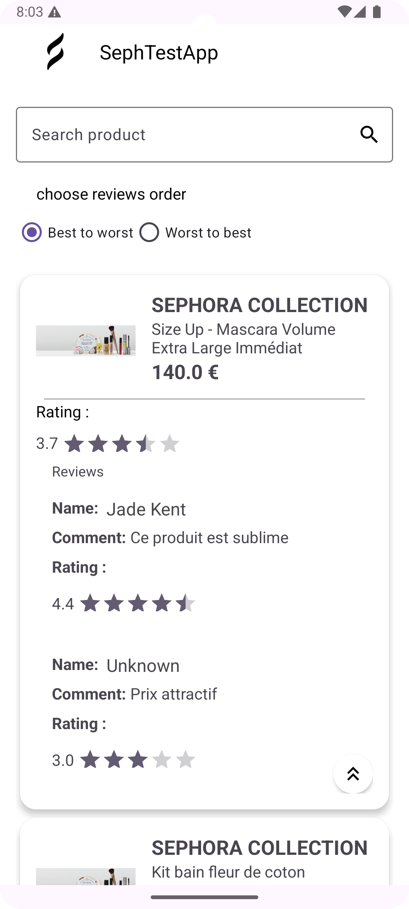
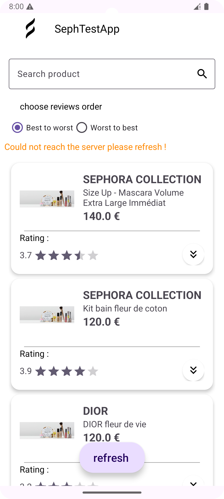
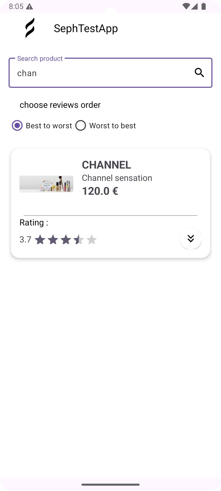

# SephTestApp

An Android application built with Clean Architecture principles, showcasing best practices in Android development with a modular approach and robust testing strategy.

<table>
  <tr>
    <td></td>
    <td></td>
    <td></td>
  </tr>
   <tr>
    <td></td>
    <td></td>
     <td></td>
  </tr>
 </table>

## 🏗️ Architecture
The project follows Clean Architecture with 4 main modules:

📦 Project Structure
<code>
├── 📱 app/                # Application module
│   ├── Application class
│   ├── DI setup (Koin)
│   └── Module orchestration
│
├── 💾 data/              # Data layer
│   ├── Repositories Impl
│   ├── API Services
│   ├── Local Storage (Room)
│   └── Data Mapping
│
├── 🛠️ domain/           # Business layer
│   ├── Use Cases
│   ├── Repository Interfaces
│   ├── Domain Models
│   └── Business Logic
│
└── 🎨 presentation/     # UI layer
    ├── ViewModels
    ├── Fragments
    ├── Custom Views
    └── UI Components
    </code>

## 🛠️ Tech Stack

- **Kotlin** - Primary programming language
- **Clean Architecture** - Architectural pattern
- **MVVM** - Presentation layer pattern
- **Coroutines** - Asynchronous programming
- **Koin** - Dependency injection
- **Retrofit** - HTTP client
- **Room** - Local database
- **Glide** - Image loading
- **ViewBinding** - View binding
- **Kotlin Serialization** - JSON parsing
- **MockK** - Testing framework
- **JUnit** - Unit testing
- **MockWebServer** - API testing

### Module Details

#### App Module
- Application entry point
- Dependency Injection setup using Koin
- Module orchestration

#### Data Module
- Repository implementations
- Remote data source (Retrofit)
- Local data source (Room Database)
- Data mapping and converters
- Data entities (DTOs)

#### Domain Module
- Use cases (both Suspending and Synchronous)
- Repository interfaces
- Domain models
- Business logic

#### Presentation Module
- UI components
- ViewModels
- Fragments
- Custom views and UI utilities
- Glide image loading
  
